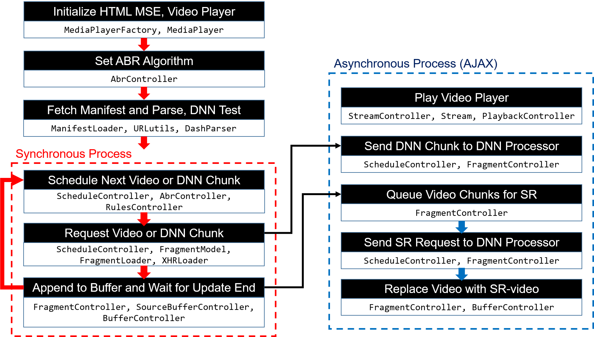

# NAS Player Documentation


## Versions
dash.js version 2.4  
**manhimahi experiment**: Chromium Browser version 65 <br/>
**browsing experiment**: No limited Chromium Browser version

## Setup

You can refer to [**CDN setup for demo**](https://github.com/kaist-ina/NAS/tree/master/demo/cdn_server) for all the file set up.

* **video setup**:  
run script ```./dash_vid_setup.sh -i [inputfile]``` in [here](https://github.com/kaist-ina/Deep-Video-Stream/tree/master/pensieve/vid_setup). <br/>
More details can be found in README.md of [here](https://github.com/kaist-ina/Deep-Video-Stream/tree/master/pensieve/vid_setup) <br/>
<br/>
	
* **manifest setup**:   
put DNN manifest information in generated multi_resolution.mpd, including DNN URL, DNN chunk configurations, etc. <br/>
	<br/>
	**Things to check and modify for manifest format before using.**
	1. Make sure ```<Adaptation Set> </Adaptation Set>``` encloses whole set up ```<Representation> </Representation>``` set pairs.
	2. You have to add ```"$RepresentationID$/"```in ```SegmentTemplate media= and initialization=``` <br/>
 		**For example)** <br/>
		```<SegmentTemplate media="$RepresentationID$/output_750k_dash$Number$.m4s" timescale="24000" startNumber="1" duration="96000" initialization="$RepresentationID$/output_750k_dashinit.mp4"/>``` <br/>
	**Example XML mpd format** can be found in [here](https://github.com/kaist-ina/NAS/blob/master/demo/cdn_server/news/multi_resolution_DNN.mpd). <br/>
<br/>

* **javascript setup**:  
complie dash.js by running ```grunt --force``` in current directory.
<br/>

* **html setup**:    
create html file. example and details can be found in [here](https://github.com/kaist-ina/Deep-Video-Stream/tree/master/NAS_mahimahi). 
<br/>

* **server setup**:   
upload html, mpd, dash.js to webserver and video files to the CDN server. <br/>
set dash.js url in javascript tag and manifest url as well.

## Running NAS Player

You can refer to [**demo setup page**](https://github.com/kaist-ina/NAS/tree/master/demo) for demo.  

* **mahimahi experiment** <br/>
    - check whether all the XML HTTP Request url is set to localhost in dash.js
    - run ```run_video+DNNproc.py```. More details can be found in [here](https://github.com/kaist-ina/Deep-Video-Stream/tree/master/NAS_mahimahi)
    <br/>
    
* **browsing experiment** <br/>
	- change all the XML HTTP Request url to url of your experiment device in dash.js
	- run ```mimic_abr.py``` in [here](https://github.com/kaist-ina/Deep-Video-Stream/tree/master/pensieve/rl_server) <br/>
	  + ```mimic_abr.py``` replays ABR log of specific trace
	  + you can set the ABR decision quality given for NAS player by running ```simple_server_br.py``` instead

## Process of NAS Player

**Figure of required class and factory js code for each process.**

## Documentation
[API Documentation](https://github.com/kaist-ina/Deep-Video-Stream/wiki/NAS-Player-API-Documentation) is available describing major function calls and class required for each process in the figure above.

